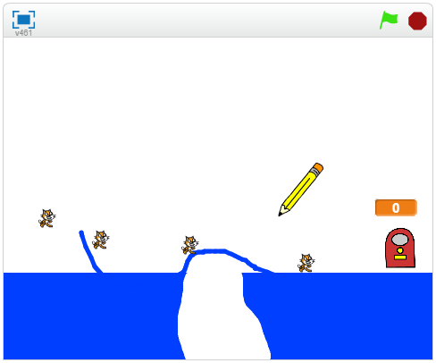

--- no-print ---

This is the **Scratch 2** version of the project. There is also a [Scratch 3 version of the project](https://projects.raspberrypi.org/en/projects/cats).

--- /no-print ---

## Introduction

In this project, you will create a game in which you need to guide cats to safety and not let any of them fall through the gaps!

### What you will make

--- no-print ---
Click and drag with the mouse to draw a line with the pencil. Your goal is to stop the cats from falling into holes by creating a safe path to the exit.

  <iframe allowtransparency="true" width="485" height="402" src="https://scratch.mit.edu/projects/embed/253667883/?autostart=false" frameborder="0"></iframe>

--- /no-print ---

--- print-only ---

--- /print-only ---

--- collapse ---
---
title: What you will learn
---

+ How to use a `forever` loop to constantly generate moving cats
+ How to use a `repeat until` loop to ensure your cats follow a line

--- /collapse ---

--- collapse ---
---
title: What you will need
---
### Hardware
+ A computer capable of running Scratch 2.0

### Software
+ Scratch 2.0 [offline](http://rpf.io/scratchoff){:target="_blank"}

### Downloads
+ [Offline starter project](http://rpf.io/p/en/cats-scratch2-go){:target="_blank"}

--- /collapse ---

--- collapse ---
---
title: Additional notes for educators
---
--- no-print ---
If you need to print this project, please use the [printer-friendly version](https://projects.raspberrypi.org/en/projects/cats-scratch2/print).
--- /no-print ---

You can [find the solution for this project here](http://rpf.io/p/en/cats-scratch2-get){:target="_blank"}.

--- /collapse ---
