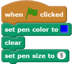
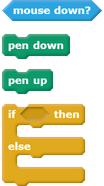
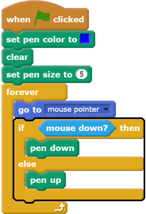
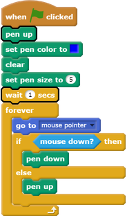

## Draw lines

--- task ---
Open the 'CATS!' Scratch [starter project](http://rpf.io/p/en/cats-scratch2-go) in the offline editor. 

If you need to download and install the Scratch offline editor, you can find it at [rpf.io/scratchoff](http://rpf.io/scratchoff){:target="_blank"}.

--- /task ---

--- task ---
Click on the sprite called 'Pen', and add code to set the pen colour to the same blue as the obstacles on the Stage.

To select a colour, click on the colour square in the `set pen color`{:class="blockpen"} block to make your mouse cursor turn into a pipette, and then click on the correct colour on the Stage.

--- /task ---

--- task ---
Add some more code to make the sprite follow the mouse pointer. Test your program to check that the code works.

[[[generic-scratch-saving]]]

--- /task ---

--- task ---
Add some code to tell the sprite to draw a line on the Stage if the mouse button is pressed down.

--- hints ---
--- hint ---
`If`{:class="blockcontrol"} the `mouse is down`{:class="blocksensing"}, put the `pen down`{:class="blockpen"}, and `else`{:class="blockcontrol"}, lift the `pen up`{:class="blockpen"}.
--- /hint ---

--- hint ---
Here are the code blocks you need:

--- /hint ---

--- hint ---
This is what your code should look like:

--- /hint ---

--- /hints ---
--- /task ---

--- task ---
Test your code. You should be able to click and drag with the mouse to draw a blue line on the Stage.

--- /task ---

You probably see that a blue dot always appears in the top right-hand corner of the Stage (it's circled in the image above). This is because, when you click the green flag to start the game, you press the mouse down, and so the pen immediately starts drawing.

--- task ---
To stop this from happening, add a `pen up`{:class="blockpen"} block at the start of the script, and a `wait one second`{:class="blockcontrol"} block above the `forever`{:class="blockcontrol"} block.

--- /task ---
