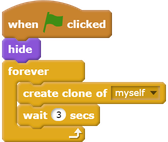
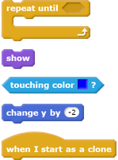
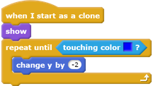

## Clone cats

You want a never-ending stream of cats that the player has to guide along the path to the exit.

--- task ---
Click on the sprite called 'Cat', and add some code to `hide`{:class="blocklooks"} the sprite, and also to `clone`{:class="blockcontrol"} it every three seconds.

--- /task ---

If you run the program now, nothing happens on the Stage. To check that a new Cat sprite clone is created every three seconds, make each clone appear and fall out of the sky.

--- task ---
Add code to tell the sprite that `when it starts as a clone`{:class="blockcontrol"}, it should `show`{:class="blocklooks"} itself and fall until it `touches`{:class="blocksensing"} the blue floor that is drawn on the Stage.

--- hints ---
--- hint ---
`When the sprite starts as a clone`{:class="blockcontrol"}, `show`{:class="blocklooks"} the sprite. `Repeatedly`{:class="blockcontrol"} `Change`{:class="blockmotion"} the sprite's `y` coordinate by `-2`, until the sprite `touches`{:class="blocksensing"} the blue Stage.
--- /hint ---

--- hint ---
Here are the code blocks you need:

--- /hint ---

--- hint ---
This is what your code should look like:

--- /hint ---
--- /hints ---

--- /task ---

When you click the green flag, you should see a new cat fall from the top of the Stage every three seconds. Every cat should land in a big pile of overlapping cats on the blue floor at the bottom.

