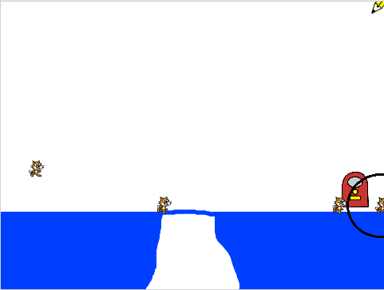

## Make the cats move

Once a cat reaches the floor, it should step slowly to the right.

--- task ---
Add code to the `when I start as a clone`{:class="blockcontrol"} section to make the cat sprite `move ten steps`{:class="blockmotion"}, and switch between the sprite's two costumes every 0.1 seconds to make the cat look like it's walking.


--- hints ---
--- hint ---

The cat sprite should `move 10 steps`{:class="blockmotion"}, and `switch costume`{:class="blocklooks"} every `0.1 seconds`{:class="blockcontrol"}. This code should repeat `forever`{:class="blockcontrol"}, just like the code to make the cat fall.

--- /hint ---

--- hint ---
Here are the code blocks you need:

```blocks
move (10) steps

wait (0.1) secs

next costume

forever
end
```
--- /hint ---

--- hint ---
This is what your code should look like:

```blocks
when I start as a clone
show
forever
    move (10) steps
    repeat until <touching color [#0000ff]?>
        change y by (-2)
    end
    next costume
    wait (0.1) secs
end
```

--- /hint ---

--- /hints ---
--- /task ---

--- task ---
Press the green flag and check that the cats now move along the blue platform at the bottom.
--- /task ---

If you draw a bridge across the gap so that the cats can get all the way to the right side of the Stage, you can see that they end up getting stuck walking into the right wall.



--- task ---
Remove the `forever`{:class="blockcontrol"} loop, and instead add a different loop to make the cats only walk until they reach an edge. When a cat reaches the edge of the Stage, it should disappear.


```blocks
when I start as a clone
show
+ repeat until <touching [edge v]?>
    move (10) steps
    repeat until <touching color [#0000ff]?>
        change y by (-2)
    end
    next costume
    wait (0.1) secs
end
+ delete this clone
```

--- /task ---

--- task ---
Press the green flag and check that the cats disappear when they reach the edge of the Stage.

--- /task ---

You may notice that, if the cats fall into the hole, they don't disappear but instead get stuck at the bottom. This is because they keep trying to fall downwards.

This is the part of the code that tells the cat to keep falling until it touches blue:

```blocks
repeat until <touching color [#0000ff]?>
end
```

However, in the hole, the cat can never reach blue, so it is stuck forever.

--- task ---
Add more blocks to this loop so that it repeats until the cat sprite is touching blue `or`{:class="blockoperators"} `touching the edge`{:class="blocksensing"}. This way, the sprite stops trying to fall if it reaches the edge of the Stage.


```blocks
repeat until <<touching color [#0000ff]?> or <touching [edge v]?>>
end
```
--- /task ---
